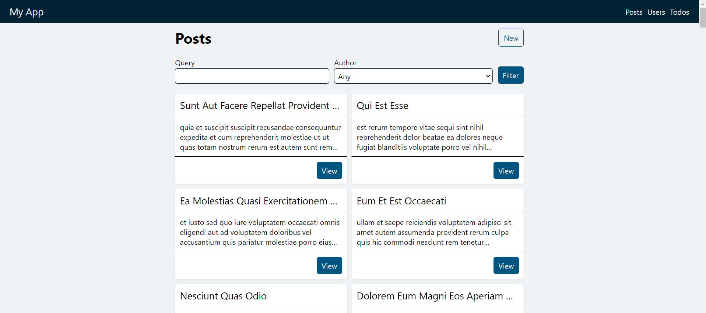
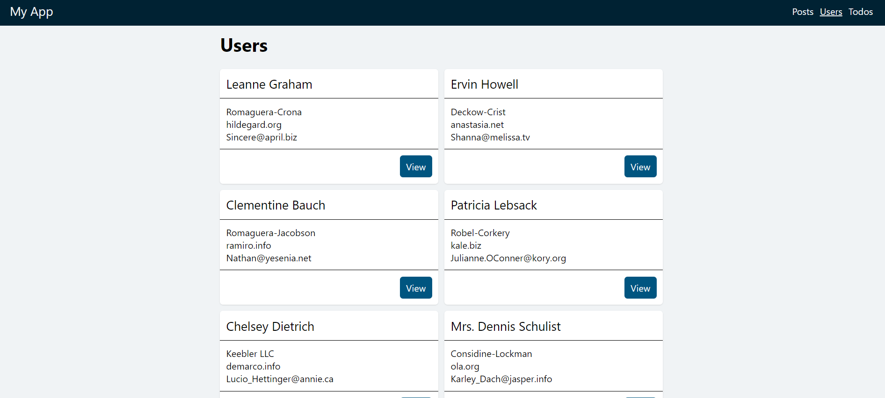
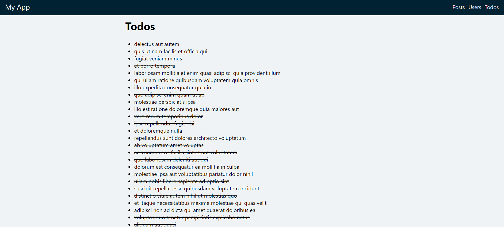
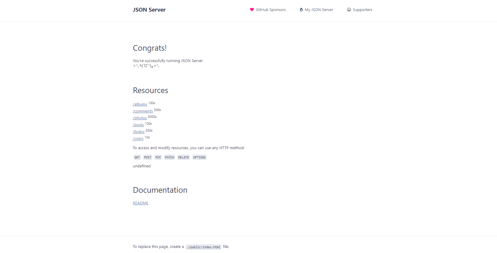

# Blog Web Project

## Description

This project is an advanced routing application built with React and React Router. It features sections for managing users, posts, and todos, providing users with a seamless experience for viewing, creating, and managing their data.

## Features

- **User Management**: 
  - View a comprehensive list of users with their details (name, email, company, etc.).
  - Navigate to individual user pages for more information.

- **Post Management**: 
  - Filter posts by user and search by query.
  - Create new posts associated with selected users.

- **Todo Management**: 
  - View todos with completion status.
  - Create new todos and track their progress.

## API and Client

- **API**: The backend API is hosted locally at [http://127.0.0.1:3000/](http://127.0.0.1:3000/).
- **Client**: The frontend application is hosted locally at [http://localhost:5173/](http://localhost:5173/).

## Technologies Used

- **Frontend**: 
  - **React**: A JavaScript library for building user interfaces.
  - **React Router**: Declarative routing for React.js.
  - **Axios**: A promise-based HTTP client for the browser and Node.js.

- **APIs**: 
  - Custom RESTful API for managing users, posts, and todos.

## Usage

- **Users Section**: Access the `/users` route to view a list of users. Click on a user to view more details.
  
- **Posts Section**: Navigate to `/posts` to view, filter, and create posts. Use the search functionality to find specific posts by user or query.

- **Todos Section**: Visit `/todos` to view your todos. Click to create a new todo and mark them as complete.

## API Endpoints

- **GET /users**: Retrieve a list of users.
- **GET /posts**: Retrieve a list of posts.
- **GET /todos**: Retrieve a list of todos.
- **POST /todos**: Create a new todo with the following structure:
  ```json
  {
    "title": "Todo Title",
    "completed": false
  }
  ```
## Working (Screenshorts)
  **Post Page**


  **User Page**
 

  **Todo Page**


  **Api Page**


## Folder Structure
```
├── src
│   ├── api                # API service files for data fetching
│   ├── components         # Reusable components (e.g., PostCard, TodoItem)
│   ├── layouts            # Layout components for organizing routes
│   ├── pages              # Page components for each route (Users, Posts, Todos)
│   ├── App.jsx            # Main application component
│   └── index.js           # Entry point of the application
├── .env                   # Environment variables
├── package.json           # Project dependencies and scripts
└── README.md              # Project documentation

```
## Acknowledements
1. React - A JavaScript library for building user interfaces.
2. React Router - Declarative routing for React.js.
3. Axios - Promise based HTTP client for the browser and Node.js.

## Contribution
If you'd like to contribute to this project, please fork the repository and submit a pull request. Contributions are welcome and appreciated!

**Guidelines for Contribution**
Ensure your code follows the existing coding style.
Write clear and concise commit messages.
Include relevant tests for any new features or bug fixes

## Contact
For any inquiries or support, please reach out via mannatgupta146@gmail.com.

